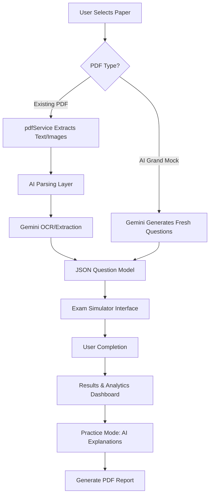

# ICET 2026 Mock Preparation Portal 🎓

[](https://github.com/VoidWareLabs)
[](https://reactjs.org/)
[](https://deepmind.google/technologies/gemini/)

A premium, full-featured mock examination portal designed for **AP ICET 2026** aspirants. This application provides a high-fidelity simulation of the real exam environment with AI-powered explanations, section-wise tracking, and comprehensive practice sets.

---

## ✨ Features

- **🚀 21 Comprehensive Mock Tests**:
    - **19 Shift Papers**: Authentic shift-wise papers from 2019–2024.
    - **2 Grand Mocks**: Full-length AI-curated tests including historical solved sets and business terminology.
- **🤖 AI-Powered Intelligence**:
    - Motivational quotes generated by **Google Gemini** on every visit.
    - Automated step-by-step explanations for every question.
- **⏱️ Professional Exam Simulator**:
    - Standardized 90-minute timer.
    - Real-time question palette (Answered, Marked for Review, Not Visited).
- **📋 Practice Mode**:
    - Review all questions post-exam with detailed AI reasoning.
    - **Downloadable PDF Reports** for offline study.
- **💎 Premium Design**: Clean, academic-focused UI built with Tailwind CSS v4 and Framer Motion.

---

## 🏗️ System Architecture & Workflow

The following flowchart illustrates how the application processes PDF data and integrates with Gemini AI:



---

## 🛠️ Installation & Setup

### Prerequisites
- **Node.js**: v18.0.0 or higher
- **npm**: v9.0.0 or higher
- **Gemini API Key**: Required for AI features ([Get it here](https://aistudio.google.com/app/apikey))

### Getting Started

1. **Clone the repository**:
   ```bash
   git clone https://github.com/saran-github232/ICET-PREPARATION-APPLICATION-2026.git
   cd ICET-PREPARATION-APPLICATION-2026/app-final
   ```

2. **Install dependencies**:
   ```bash
   npm install
   ```

3. **Start the development server**:
   ```bash
   npm run dev
   ```

4. **Build for production**:
   ```bash
   npm run build
   ```

---

## 🖥️ System Requirements

- **Minimum RAM**: 4GB
- **Browser**: Modern browser (Chrome 90+, Edge 90+, Safari 14+)
- **Internet**: Required for initial page load and Gemini AI features.

---

## 🤝 Contribution & Open Source

We welcome contributions to make this portal even better!

1. **Fork** the project.
2. **Create your Feature Branch** (`git checkout -b feature/AmazingFeature`).
3. **Commit your Changes** (`git commit -m 'Add some AmazingFeature'`).
4. **Push to the Branch** (`git push origin feature/AmazingFeature`).
5. **Open a Pull Request**.

---

## 📜 Rights & Credits

Designed and developed with ❤️ by **VoidWareLabs**.
© 2026 ICET Mock Portal. All Rights Reserved.
